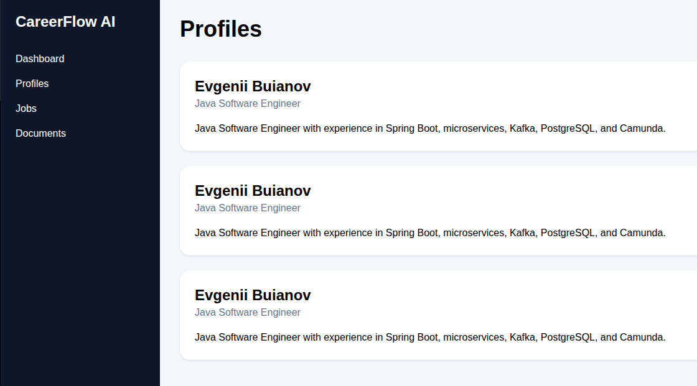
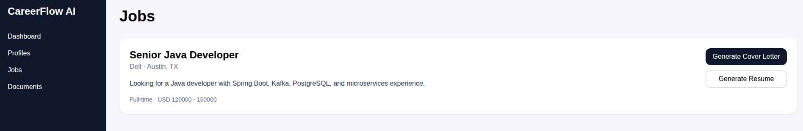
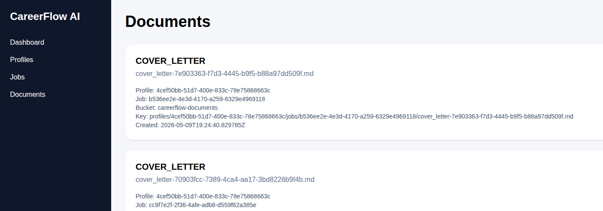
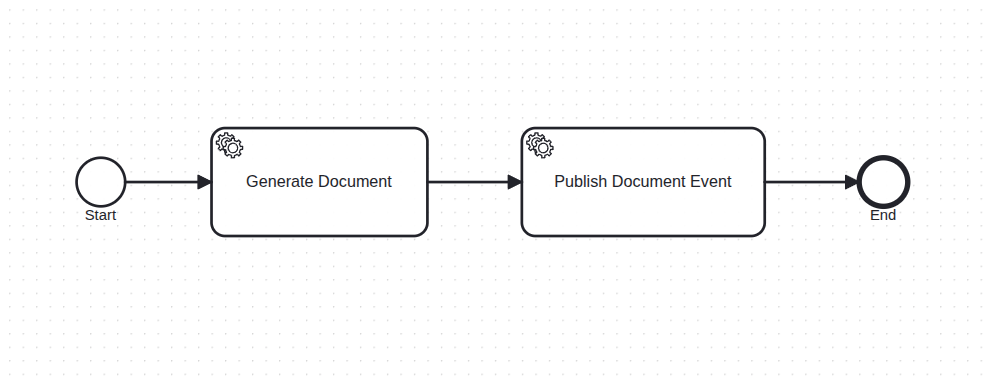
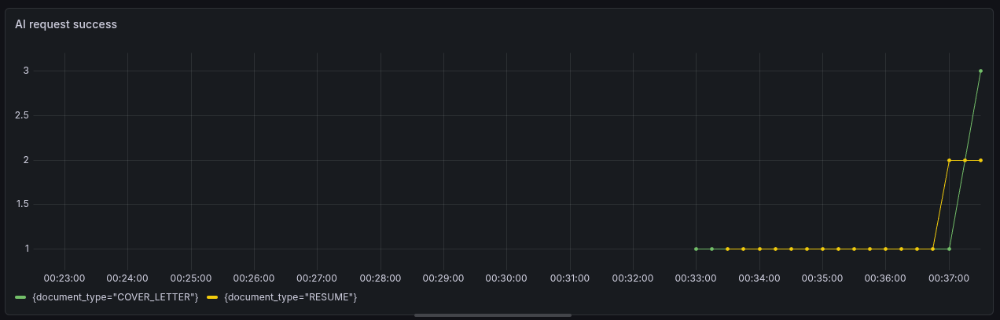

# CareerFlow AI

AI-powered resume tailoring and job application automation platform built with Java microservices, Camunda 8 workflows, Kafka event streaming, Spring AI, and React.

---


---

# Overview

CareerFlow AI helps candidates automatically generate tailored resumes and cover letters for specific job descriptions using AI-powered workflows.

The platform demonstrates a production-style distributed architecture using:

Main capabilities:

- Create and manage candidate profiles
- Create and manage job descriptions manually
- Parse raw job descriptions with AI
- Generate tailored resumes and cover letters
- Orchestrate document generation with Camunda 8
- Publish document events through Kafka
- Store generated documents in MinIO
- Preview documents in the UI
- Download documents as PDF or DOCX
- Track workflow status with WebSocket and polling fallback
- Protect APIs with JWT authentication

## Tech Stack

### Backend

- Java 21
- Spring Boot
- Spring Cloud Gateway
- Spring Security
- Spring AI
- Camunda 8
- Kafka
- PostgreSQL
- MinIO
- Micrometer / Prometheus ready
- Maven

### Frontend

- React
- TypeScript
- Vite
- Tailwind CSS
- Axios
- React Router

---

# Architecture

```text

React Frontend
      |
      v
Reactive API Gateway
      |
      +-----------------------------+
      |                             |
      v                             v
Auth Service                 Profile Service
Job Service                  Matching Service
AI Generation Service        Workflow Service
Document Service
      |
      v
Kafka
      |
      v
Document Service
      |
      +------------+
      |            |
      v            v
PostgreSQL       MinIO

```
# Main Workflow

```text
User creates profile
User creates or AI-parses job description
User selects profile and job
User starts document generation
Workflow Service starts Camunda process
AI Generation Service creates content
Workflow Service publishes Kafka event
Document Service stores document metadata in PostgreSQL
Document Service stores document content in MinIO
Frontend shows status and document preview
User downloads PDF or DOCX
```

# Services

| Service | Port | Description |
|---|---|---|
|api-gateway-service	|8080|	Single API entry point|
|auth-service	|8079|	Login and JWT issuing|
|profile-service	|8081|	Candidate profiles|
|job-service	|8082|	Job descriptions|
|matching-service	|8083|	Job/profile matching|
|ai-generation-service	|8084|	AI generation and parsing|
|document-service	|8085|	Documents, MinIO, PDF/DOCX export|
|workflow-service	|8086|	Camunda workflow orchestration|
|Kafka	|9092|	Event streaming|
|MinIO Console	|9001|	Object storage UI|
|Prometheus	|9090|	Metrics|
|Grafana	|3001|	Dashboards|


# Running the Project
## Requirements
- Java 21
- Maven 3.9+
- Docker
- Node.js 22+

## Start Infrastructure

```Bash
docker compose up -d
```

## Start Backend Services

```Bash
cd backend/profile-service
mvn spring-boot:run
```
Repeat for all services.

## Start Frontend

```Bash
cd frontend/web-app

npm install

npm run dev
```

Frontend:

[http://localhost:5173](http://localhost:5173)

Demo login:

```text
demo / demo
```

## Environment Configuration

Set environment variable:
```Bash
export OPENAI_API_KEY=your_key_here
export JWT_SECRET=change-me-change-me-change-me-change-me
```

## Core API Examples

Login

```Bash
curl -X POST http://localhost:8080/api/v1/auth/login \
  -H "Content-Type: application/json" \
  -d '{"username":"demo","password":"demo"}'
```

Start document generation workflow

```Bash
curl -X POST http://localhost:8080/api/v1/workflows/document-generation \
  -H "Content-Type: application/json" \
  -H "Authorization: Bearer TOKEN" \
  -d '{
    "profileId": "PROFILE_ID",
    "jobId": "JOB_ID",
    "documentType": "COVER_LETTER"
  }'
```

Download PDF

```Bash
curl -L http://localhost:8080/api/v1/documents/DOCUMENT_ID/pdf \
-H "Authorization: Bearer TOKEN" \
-o document.pdf
```
`
Download DOCX

```Bash
curl -L http://localhost:8080/api/v1/documents/DOCUMENT_ID/docx \
-H "Authorization: Bearer TOKEN" \
-o document.docx
```

## Example Generated Document
```text
Dear Hiring Team,

I am excited to apply for the Senior Java Developer position at Company...

...
```

# Screenshots
  Profiles



Jobs



Documents



Camunda Workflow



Metrics in Grafana



## API Documentation

Swagger UI is available at:

| Service | Swagger URL |
|---|---|
| auth-service | http://localhost:8079/swagger-ui.html |
| profile-service | http://localhost:8081/swagger-ui.html |
| job-service | http://localhost:8082/swagger-ui.html |
| matching-service | http://localhost:8083/swagger-ui.html |
| ai-generation-service | http://localhost:8084/swagger-ui.html |
| document-service | http://localhost:8085/swagger-ui.html |
| workflow-service | http://localhost:8086/swagger-ui.html |

## Learning Goals

This project was built to demonstrate:

- Distributed systems design
- Event-driven architecture
- Workflow orchestration
- AI integration in enterprise systems
- Microservice communication
- Async processing patterns
- Modern fullstack architecture

## License
```text
# License

MIT License

Copyright (c) 2026 Evgenii Buianov

Permission is hereby granted, free of charge, to any person obtaining a copy
of this software and associated documentation files (the "Software"), to deal
in the Software without restriction, including without limitation the rights
to use, copy, modify, merge, publish, distribute, sublicense, and/or sell
copies of the Software, and to permit persons to whom the Software is
furnished to do so, subject to the following conditions:

The above copyright notice and this permission notice shall be included in all
copies or substantial portions of the Software.

THE SOFTWARE IS PROVIDED "AS IS", WITHOUT WARRANTY OF ANY KIND, EXPRESS OR
IMPLIED, INCLUDING BUT NOT LIMITED TO THE WARRANTIES OF MERCHANTABILITY,
FITNESS FOR A PARTICULAR PURPOSE AND NONINFRINGEMENT. IN NO EVENT SHALL THE
AUTHORS OR COPYRIGHT HOLDERS BE LIABLE FOR ANY CLAIM, DAMAGES OR OTHER
LIABILITY, WHETHER IN AN ACTION OF CONTRACT, TORT OR OTHERWISE, ARISING FROM,
OUT OF OR IN CONNECTION WITH THE SOFTWARE OR THE USE OR OTHER DEALINGS IN THE
SOFTWARE.
```

