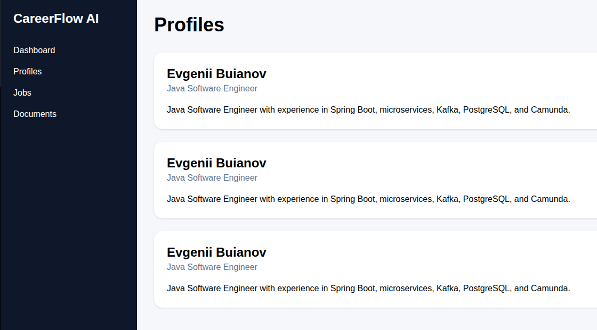
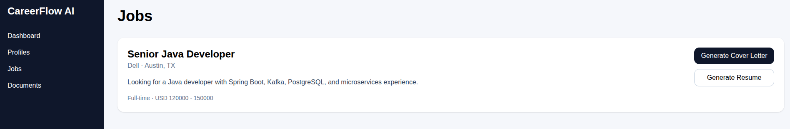
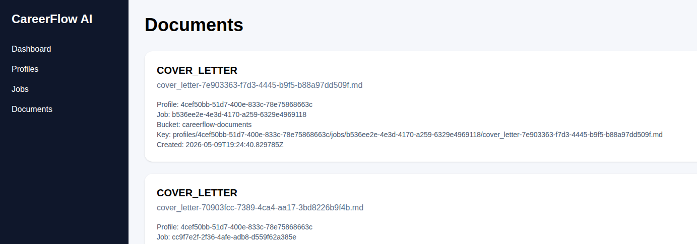
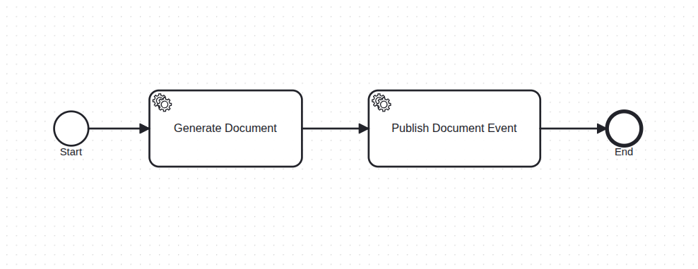
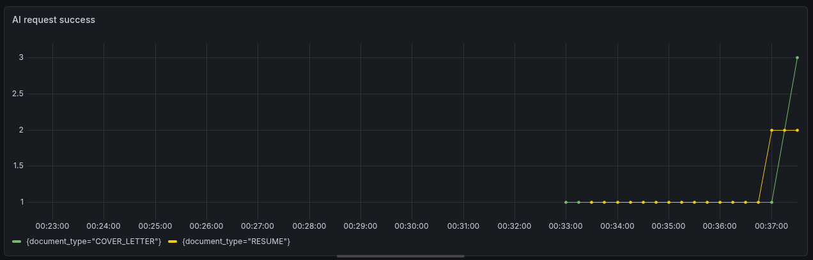

# CareerFlow AI

AI-powered resume tailoring and job application automation platform built with Java microservices, Camunda 8 workflows, Kafka event streaming, Spring AI, and React.

---


---

# Overview

CareerFlow AI helps candidates automatically generate tailored resumes and cover letters for specific job descriptions using AI-powered workflows.

The platform demonstrates a production-style distributed architecture using:

Main capabilities:

- Create and manage candidate profiles
- Create and manage job descriptions manually
- Parse raw job descriptions with AI
- Generate tailored resumes and cover letters
- Orchestrate document generation with Camunda 8
- Publish document events through Kafka
- Store generated documents in MinIO
- Preview documents in the UI
- Download documents as PDF or DOCX
- Track workflow status with WebSocket and polling fallback
- Protect APIs with JWT authentication
- **Dashboard** with KPIs, top matches, activity feed, and smart next actions
- **Email integration** — sync recruiter inbox (IMAP), classify offers/rejections/vacancies, reply with resume/cover letter PDFs (SMTP)

## Tech Stack

### Backend

- Java 21
- Spring Boot
- Spring Cloud Gateway
- Spring Security
- Spring AI
- Camunda 8
- Kafka
- PostgreSQL
- MinIO
- Micrometer / Prometheus ready
- Maven

### Frontend

- React
- TypeScript
- Vite
- Tailwind CSS
- Axios
- React Router

---

# Architecture

```text

React Frontend
      |
      v
Reactive API Gateway
      |
      +-----------------------------+
      |                             |
      v                             v
Auth Service                 Profile Service
Job Service                  Matching Service
AI Generation Service        Workflow Service
Document Service
Email Service
      |
      v
Kafka
      |
      v
Document Service
      |
      +------------+
      |            |
      v            v
PostgreSQL       MinIO

```
# Main Workflow

```text
User creates profile
User creates or AI-parses job description
User selects profile and job
User starts document generation
Workflow Service starts Camunda process
AI Generation Service creates content
Workflow Service publishes Kafka event
Document Service stores document metadata in PostgreSQL
Document Service stores document content in MinIO
Frontend shows status and document preview
User downloads PDF or DOCX
```

# Services

| Service | Port | Description |
|---|---|---|
|api-gateway-service	|8080|	Single API entry point|
|auth-service	|8079|	Login and JWT issuing|
|profile-service	|8081|	Candidate profiles|
|job-service	|8082|	Job descriptions|
|matching-service	|8083|	Job/profile matching|
|ai-generation-service	|8084|	AI generation and parsing|
|document-service	|8085|	Documents, MinIO, PDF/DOCX export|
|workflow-service	|8086|	Camunda workflow orchestration|
|email-service	|8087|	IMAP/SMTP recruiter email integration|
|Kafka	|9092|	Event streaming|
|MinIO Console	|9001|	Object storage UI|
|Prometheus	|9090|	Metrics|
|Grafana	|3001|	Dashboards|


# Running the Project
## Requirements
- Java 21
- Maven 3.9+
- Docker
- Node.js 22+

## Start Infrastructure (local JVM dev)

```bash
make infra-up
# or
docker compose -f docker-compose.yml up -d
```

Infrastructure includes PostgreSQL (profile `:5432`, job `:5433`, matching `:5434`, document `:5435`, workflow `:5436`, auth `:5437`, email `:5438`), Kafka, MinIO, Zeebe, Prometheus, and Grafana.

### Full stack in Docker (one command)

```bash
# copy env and set OPENAI_API_KEY, then:
docker compose up -d --build

# or
make up
```

This builds and starts all 9 backend services, frontend, Postgres, Kafka, MinIO, Zeebe, Prometheus, and Grafana.

| URL | Service |
|-----|---------|
| http://localhost:5173 | Frontend |
| http://localhost:8080 | API Gateway |
| http://localhost:9001 | MinIO Console |
| http://localhost:3001 | Grafana (admin/admin) |
| http://localhost:9090 | Prometheus |

Demo login: `demo` / `demo`

Infrastructure only (for local JVM development):

```bash
make infra-up
# or: docker compose -f docker-compose.yml up -d
```

## Start Backend Services (local JVM)

```bash
make backend-verify   # build + unit/integration tests first
```

Run each service from its module (auth-service needs `auth-postgres` on port `5437`):

```bash
cd backend/auth-service && mvn spring-boot:run
```

Recommended order: auth → profile → job → matching → document → ai-generation → workflow → email → api-gateway.

## Start Frontend

```bash
cd frontend/web-app
npm ci
npm run dev
```

Frontend:

[http://localhost:5173](http://localhost:5173)

Demo login:

```text
demo / demo
```

## Test Coverage

Backend uses [JaCoCo](https://www.jacoco.org/) during `mvn verify`. Each module must maintain at least **50% line coverage** (excluding Spring Boot application entrypoints).

```bash
make backend-verify
```

Integration smoke test (`DocumentPipelineSmokeIT`) uses **Testcontainers** (PostgreSQL + MinIO) in `document-service`.

Frontend unit tests use **Vitest**:

```bash
make frontend-test
```

Optional Playwright E2E (requires dev server):

```bash
cd frontend/web-app && npm run test:e2e
```

HTML coverage reports: `backend/<module>/target/site/jacoco/index.html`.

CI runs backend verify, frontend lint/test/build, Docker image builds, compose validation, and dependency review on PRs.

## Developer Commands (Makefile)

| Command | Description |
|---------|-------------|
| `make up` | Build and start full stack |
| `make down` | Stop full stack |
| `make infra-up` | Start infrastructure containers |
| `make backend-verify` | Backend tests + JaCoCo |
| `make frontend-test` | Frontend Vitest suite |
| `make frontend-build` | Lint + production build |
| `make docker-build` | Build core Docker images |
| `make compose-validate` | Validate compose files |

## Observability

All HTTP requests propagate `X-Correlation-Id` through the API gateway and microservices (MDC logging in servlet services).

## Environment Configuration

Set environment variables (see `.env.example`):

```Bash
export OPENAI_API_KEY=your_key_here
export JWT_SECRET=change-me-change-me-change-me-change-me
export CAREERFLOW_INTERNAL_API_KEY=local-internal-key
export CAREERFLOW_EMAIL_ENCRYPTION_KEY=0123456789abcdef0123456789abcdef
export CAREERFLOW_ADMIN_PASSWORD=ChangeMeNow123!
```

`CAREERFLOW_EMAIL_ENCRYPTION_KEY` must be exactly 32 characters — used to encrypt mailbox passwords in `email-service`.

`JWT_SECRET` must be at least 32 characters and shared across auth-service, api-gateway, and all resource servers.

`CAREERFLOW_INTERNAL_API_KEY` secures service-to-service calls (workflow → ai-generation → profile/job).

Refresh tokens are stored in PostgreSQL (`careerflow_auth` on port `5437`), not in memory.

WebSocket workflow status requires a valid JWT (`token` query param or `Authorization` header) matching the workflow owner.

Refresh an expired access token:

```Bash
curl -X POST http://localhost:8080/api/v1/auth/refresh \
  -H "Content-Type: application/json" \
  -d '{"refreshToken":"YOUR_REFRESH_TOKEN"}'
```

## Core API Examples

Login

```Bash
curl -X POST http://localhost:8080/api/v1/auth/login \
  -H "Content-Type: application/json" \
  -d '{"username":"demo","password":"demo"}'
```

Start document generation workflow

```Bash
curl -X POST http://localhost:8080/api/v1/workflows/document-generation \
  -H "Content-Type: application/json" \
  -H "Authorization: Bearer TOKEN" \
  -d '{
    "profileId": "PROFILE_ID",
    "jobId": "JOB_ID",
    "documentType": "COVER_LETTER"
  }'
```

Download PDF

```Bash
curl -L http://localhost:8080/api/v1/documents/DOCUMENT_ID/pdf \
-H "Authorization: Bearer TOKEN" \
-o document.pdf
```

Download DOCX

```Bash
curl -L http://localhost:8080/api/v1/documents/DOCUMENT_ID/docx \
-H "Authorization: Bearer TOKEN" \
-o document.docx
```

## Example Generated Document
```text
Dear Hiring Team,

I am excited to apply for the Senior Java Developer position at Company...

...
```

# Screenshots
  Profiles



Jobs



Documents



Camunda Workflow



Metrics in Grafana



## API Documentation

Swagger UI is available at:

| Service | Swagger URL |
|---|---|
| auth-service | http://localhost:8079/swagger-ui.html |
| profile-service | http://localhost:8081/swagger-ui.html |
| job-service | http://localhost:8082/swagger-ui.html |
| matching-service | http://localhost:8083/swagger-ui.html |
| ai-generation-service | http://localhost:8084/swagger-ui.html |
| document-service | http://localhost:8085/swagger-ui.html |
| workflow-service | http://localhost:8086/swagger-ui.html |
| email-service | http://localhost:8087/swagger-ui.html |

## Documentation

| Topic | Path |
|-------|------|
| Local development | [docs/runbook/local-development.md](docs/runbook/local-development.md) |
| Dashboard & UI pages | [docs/frontend/dashboard.md](docs/frontend/dashboard.md) |
| Email integration | [docs/email/email-integration.md](docs/email/email-integration.md) |
| API examples | [docs/api/api-examples.md](docs/api/api-examples.md) |
| System overview | [docs/architecture/system-overview.md](docs/architecture/system-overview.md) |

This project was built to demonstrate:

- Distributed systems design
- Event-driven architecture
- Workflow orchestration
- AI integration in enterprise systems
- Microservice communication
- Async processing patterns
- Modern fullstack architecture

## License
```text
# License

MIT License

Copyright (c) 2026 Evgenii Buianov

Permission is hereby granted, free of charge, to any person obtaining a copy
of this software and associated documentation files (the "Software"), to deal
in the Software without restriction, including without limitation the rights
to use, copy, modify, merge, publish, distribute, sublicense, and/or sell
copies of the Software, and to permit persons to whom the Software is
furnished to do so, subject to the following conditions:

The above copyright notice and this permission notice shall be included in all
copies or substantial portions of the Software.

THE SOFTWARE IS PROVIDED "AS IS", WITHOUT WARRANTY OF ANY KIND, EXPRESS OR
IMPLIED, INCLUDING BUT NOT LIMITED TO THE WARRANTIES OF MERCHANTABILITY,
FITNESS FOR A PARTICULAR PURPOSE AND NONINFRINGEMENT. IN NO EVENT SHALL THE
AUTHORS OR COPYRIGHT HOLDERS BE LIABLE FOR ANY CLAIM, DAMAGES OR OTHER
LIABILITY, WHETHER IN AN ACTION OF CONTRACT, TORT OR OTHERWISE, ARISING FROM,
OUT OF OR IN CONNECTION WITH THE SOFTWARE OR THE USE OR OTHER DEALINGS IN THE
SOFTWARE.
```

